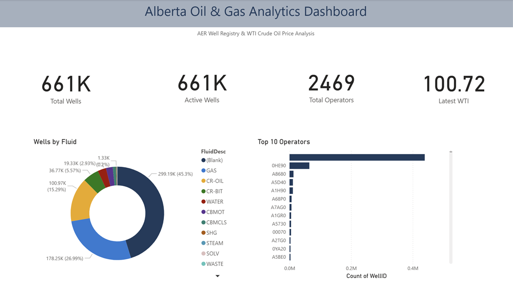
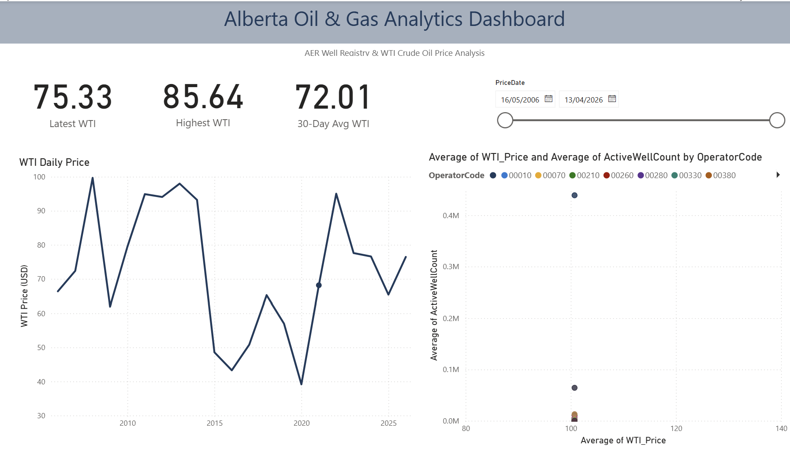
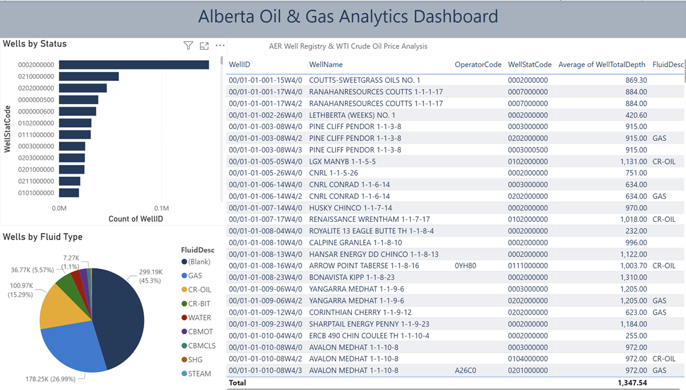
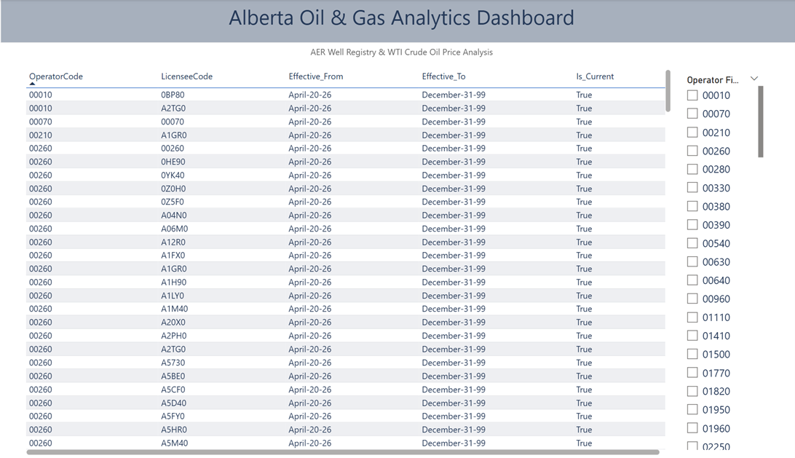
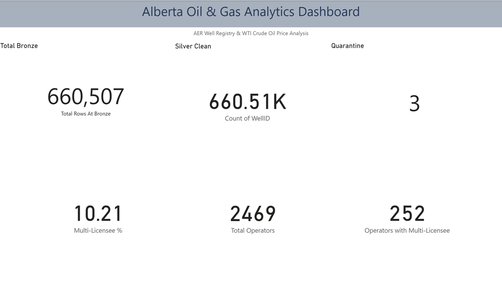

# Alberta Oil & Gas Analytics Pipeline

This project provides hands-on experience implementing an enterprise-grade Alberta energy data pipeline using Azure data services. The project ingests real Alberta Energy Regulator (AER) ST37 well registry data and U.S. Energy Information Administration (EIA) WTI crude oil prices, transforms data through a complete medallion architecture, and delivers Power BI dashboards for the Calgary energy sector.

## Architecture

- **Pattern**: Batch Medallion Architecture (Bronze → Silver → Gold) with TRUE SCD Type 2 via Azure SQL DB MERGE.

## Role

Assumed the role of a Data Engineer responsible for implementing an end-to-end data pipeline in Azure for the Calgary energy sector, targeting employers like Cenovus, Suncor, CNRL, and Husky.

## Source Systems

- **API**: Extracting daily WTI crude oil prices from EIA REST API.
  - https://api.eia.gov/v2/petroleum/pri/spt/data/
  - API key stored in Azure Key Vault (no hardcoded credentials)
  - Data dumped into both ADLS Bronze and `staging.OilPrice` table in Azure SQL DB

- **On-Prem SQL Server**: Extracting AER ST37 well registry data (660,507 rows) from on-premises SQL Server via Self-Hosted Integration Runtime.
  - Following medallion architecture (Bronze → Silver → Gold)
  - 1 source table: `dbo.WellList` (24 columns from AER ST37 file)
  - Bringing data into ADLS Gen2 Bronze layer as Parquet
  - Using Synapse Serverless SQL CETAS for cleaning duplicates, validation (NULL UWI check, invalid date check, negative depth check) — Validation Scenarios
  - Removing unnecessary columns and standardizing 'N/A' values to NULL
  - **SCD Type 1** implemented for `Dim_LicenceStatus` and `Dim_WellType` (UPSERT on changes)
  - **SCD Type 2** implemented for `Dim_Operator` and `Dim_Well` (expire + insert pattern with Effective_From/Effective_To/Is_Current)
  - Ingesting transformed data into Azure SQL Database Gold layer

## Azure Data Lake Storage (ADLS)

- **Bronze Layer**: Raw ingested data from source systems (no modifications) — Parquet format
  - `/bronze/well/{date}/` — AER ST37 raw data
  - `/bronze/oilprice/{date}/` — EIA API JSON converted to Parquet

- **Silver Layer**: Cleansed and transformed data — Strictly Parquet format
  - `/silver/clean/{date}/` — validated wells with type-cast columns
  - `/quarantine/well_rejects/{date}/` — invalid rows with RejectReason

- **Gold Layer**: Archival snapshots of dimensional model — Parquet format
  - `/gold/dim_operator/`, `/gold/dim_well/`, `/gold/fact_oilprice/` etc.

## Data Transformation

- **Tools**:
  - Azure Data Factory (ADF) for orchestration and Copy Activities
  - Azure Synapse Serverless SQL with CETAS (CREATE EXTERNAL TABLE AS SELECT) for file-based transformations (Bronze → Silver, Bronze OilPrice → Gold)
  - Azure SQL DB native T-SQL MERGE for SCD Type 1 and SCD Type 2 row-level operations

- **Architectural Decision**: Synapse Serverless cannot perform row-level UPDATE on Parquet files (immutable file format), so SCD Type 2 logic runs in Azure SQL DB. Synapse Dedicated Pool with Delta Lake would also work but costs $1,000-$5,000/month vs Azure SQL Basic at $7/month.

## Target System

- **Azure SQL Database** (`aer-oilgas-gold-db`): Storing the final processed and transformed dimensional model.
  - **Staging schema**: `staging.Silver_Wells`, `staging.OilPrice` (transient, TRUNCATE+RELOAD)
  - **Gold schema**: 
    - `gold.Dim_Operator` (SCD Type 2)
    - `gold.Dim_Well` (SCD Type 2)
    - `gold.Dim_LicenceStatus` (SCD Type 1)
    - `gold.Dim_WellType` (SCD Type 1)
    - `gold.Fact_OilPrice` (UPSERT)
    - `gold.Fact_WellSnapshot` (daily reload)
    - `gold.vw_WellMarketTrend` (analytical view)

## Business Questions Answered

| # | Question | Gold Source | Dashboard Page |
|---|----------|-------------|----------------|
| Q1 | Active wells by field/operator | `gold.Fact_WellSnapshot` | Page 3 |
| Q2 | Operators with most wells | `gold.Dim_Operator` + `Fact_WellSnapshot` | Page 1, Page 4 |
| Q3 | WTI oil price trends | `gold.Fact_OilPrice` | Page 2 |
| Q4 | Activity vs oil price correlation | `gold.vw_WellMarketTrend` | Page 5 (view) |
| Q5 | Operator ownership transfers | `gold.Dim_Operator` (SCD2) | Page 4 |
| Q6 | Well type & licence distribution | `gold.Dim_WellType` + `Dim_LicenceStatus` | Page 3 |

## Data Visualization

- **Power BI**: Created 5-page dashboard analyzing Alberta well activity and WTI oil price trends. Connected via Azure SQL Database (Import mode) for sub-second query performance.
  - Power BI Desktop: https://www.microsoft.com/en-us/download/details.aspx?id=58494
  - Workspace: `mywworkspace account`

### Dashboard Pages

**Page 1 — Executive Summary**

> Alberta has 661K registered wells operated by 2,469 unique operators. Top operator (0HE90 = Cenovus) holds the largest portfolio with 65K+ wells. 45% of wells are in 'Blank' fluid status indicating exploration or abandoned wells. GAS (27%) and CR-OIL (15%) are the dominant production fluids in Alberta's energy sector.

---

**Page 2 — Oil Price Trends**

> WTI crude oil peaked at $100 in 2008 before crashing during the global financial crisis, collapsed again to $40 during the 2020 COVID demand shock, and recovered strongly to $93 in 2022 driven by post-pandemic supply constraints and Russia-Ukraine war tensions. The current 30-day average of $72.01 reflects ongoing market softening as OPEC+ adjusts production targets. Alberta operators respond directly to these price signals — the scatter plot shows that at current WTI levels, the largest operator maintains over 400,000 active wells while smaller operators scale back significantly, demonstrating price-sensitive drilling behavior across Calgary's energy sector.

---

**Page 3 — Well Activity**

> Status code 0002000000 (Producing/Flowing) dominates well registrations indicating Alberta's mature production base. Average well depth is 1,347m — typical for conventional Alberta plays. Top wells include CNRL CONRAD, Husky CHINCO, and Renaissance Wrentham reflecting major operators in central Alberta's Western Sedimentary Basin.

---

**Page 4 — Operator Analysis (SCD2 Proof)**

> SCD Type 2 successfully tracks operator-licensee relationships. Operator '00260' shows 30+ licensee codes demonstrating real-world M&A activity in Alberta's energy sector. Each row preserves point-in-time ownership history with Effective_From/Effective_To dates — enabling historical analysis of corporate restructuring, asset transfers, and licensee transitions.

---

**Page 5 — Data Quality**

> Pipeline ingested 660,507 wells from on-prem AER ST37 file with very few data quality issues. SCD Type 2 tracked 252 operators (10.21%) with multiple licensee codes — proving real Alberta M&A activity captured in dimensional history. Bronze→Silver→Gold medallion architecture validated end-to-end.

## Data Validations

- **Row Count Check**: 
  - Bronze rows = 660,507
  - Silver clean = 660,504 (after CETAS validation)
  - Quarantine = 3 
  - Bronze count = Silver count + Quarantine count 

- **3 Validation Rules** implemented in Synapse CETAS:
  - `NULL_UWI`: UWI_DISPLAY_FORMAT IS NULL or empty
  - `INVALID_DATE`: LICENSE_ISSUE_DATE not 8 characters (YYYYMMDD format)
  - `NEGATIVE_DEPTH`: WELL_TOTAL_DEPTH < 0 (impossible value)

- **Pipeline JSON Validation**: All 7 pipeline JSONs validated and exported.

- **SCD Type 2 Validation Demo**: 
  - Updated `LicenseeCode` for `OperatorCode = '0Z5F0'` in staging
  - Re-ran `PL_SCD2_MERGE`
  - Verified: old row marked `Is_Current=False` with `Effective_To = today`, new row inserted with `Is_Current=True` and `Effective_To = '9999-12-31'`

## Triggers

- **Scheduled Trigger** (`TR_Daily_Schedule`): Runs `PL_Master_Orchestrator` daily at 1:00 AM UTC.
  - Triggers EIA API ingestion via `PL_EIA_to_Staging` (API → Bronze → SQL Staging)
  - Triggers on-prem SQL Server ingestion (ST37 → Bronze)
  - Silver layer follows after Bronze succeeds (dependency chain)
  - Gold layer (SCD2 MERGE) is continuation of Silver layer

## Pipelines (7 Total)

| # | Pipeline | Purpose |
|---|---|---|
| 1 | `PL_ST37_to_Bronze` | On-prem SQL → ADLS Bronze (Self-Host IR) |
| 2 | `PL_EIA_to_Staging` | EIA REST API → ADLS Bronze + SQL Staging |
| 3 | `PL_Bronze_to_Silver_quarantine` | Synapse CETAS → Silver + Quarantine |
| 4 | `PL_Bronze_OilPrice_to_Gold` | Synapse CETAS → Gold OilPrice Parquet |
| 5 | `PL_Silver_to_Staging_SQL` | ADLS Silver → Azure SQL staging |
| 6 | `PL_SCD2_MERGE` | TRUE SCD Type 2 MERGE on Azure SQL DB |
| 7 | `PL_Master_Orchestrator` | Chains all 6 pipelines with dependencies |

## Project Deliverables

- **SQL Scripts**: 
  - DDL (schema creation): `staging.Silver_Wells`, `staging.OilPrice`, `gold.Dim_Operator`, `gold.Dim_Well`, `gold.Dim_LicenceStatus`, `gold.Dim_WellType`, `gold.Fact_OilPrice`, `gold.Fact_WellSnapshot`, `gold.vw_WellMarketTrend`
  - DML (sample data): `dbo.WellList` table populated from AER ST37 file
  - Synapse CETAS scripts: `01_bronze_to_silver_and_quarantine.sql`, `02_bronze_oilprice_to_gold.sql`
  - SCD2 MERGE script: `03_scd2_merge_all.sql`

- **Pipeline JSON**: Exported JSON of all 7 ADF pipelines in `/pipelines/` folder

- **Architecture Diagram**: `Architecture_diagram.jpg` (Draw.io export)

- **Power BI**: `AER_OilGas_Dashboard.pbix` published to Power BI Service

## Security

**Azure Key Vault** (`aer-oilgas-kv`) is used as part of the project to store:
- `eia-api-key`: EIA REST API key
- `onprem-sql-password`: On-premises SQL Server credentials

Secrets are retrieved at runtime via:
- **Managed Identity** (system-assigned to ADF, Synapse, Azure SQL)
- **Web Activity** in ADF for Key Vault REST API calls
- **Linked Service Key Vault references** for password injection

**Zero hardcoded credentials anywhere in the project** — all authentication uses Managed Identity + Key Vault pattern.

## Technology Stack

- **Cloud**: Microsoft Azure
- **Storage**: Azure Data Lake Storage Gen2
- **Orchestration**: Azure Data Factory + Self-Hosted Integration Runtime
- **Compute**: Azure Synapse Serverless SQL Pool (file transformations)
- **Database**: Azure SQL Database Basic tier ($7/month)
- **Security**: Azure Key Vault + Managed Identity + Microsoft Entra ID
- **Visualization**: Power BI Desktop + Power BI Service
- **CI/CD**: GitHub Actions for ADF deployment
- **Source Data**: AER ST37 (Alberta Energy Regulator) + EIA REST API (U.S. Government)

## Cost Analysis (Actual from Azure Billing — AER Project Only)

| Service | Weekly Cost | Monthly Projection |
|---|---|---|
| Azure Data Factory v2 | CA$0.76 | CA$3.04 |
| ADLS Gen2 Storage | CA$0.05 | CA$0.20 |
| Azure Synapse Serverless | CA$0.02 | CA$0.08 |
| Azure Key Vault | <CA$0.01 | <CA$0.04 |
| Azure SQL DB Basic | CA$0.00 | CA$0.00 |
| Bandwidth | CA$0.00 | CA$0.00 |
| **Total (AER Project)** | **CA$0.84/week** | **~CA$3.50/month** |

## Key Learnings

1. **Synapse Serverless cannot perform SCD Type 2** — Parquet files are immutable, no row-level UPDATE possible. Required architectural pivot to Azure SQL DB for MERGE operations.
2. **Composite key design** — Real Alberta data has operators with multiple licensees (Cenovus has 9+), requiring `OperatorCode + LicenseeCode` composite key in NOT EXISTS clause.
3. **Cost-conscious architecture** — Azure SQL DB Basic ($7/mo) chosen over Synapse Dedicated Pool ($1,000+/mo) for SCD MERGE workload.
4. **Real data > tutorial data** — AER public data revealed business patterns (M&A activity tracked via SCD2) not visible in synthetic datasets.

---

**Author**: Kowsalya Gopinathan  
**Date**: April 2026  
**Location**: Calgary, Alberta
