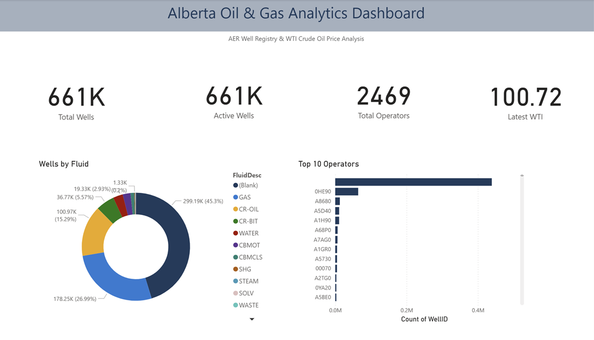
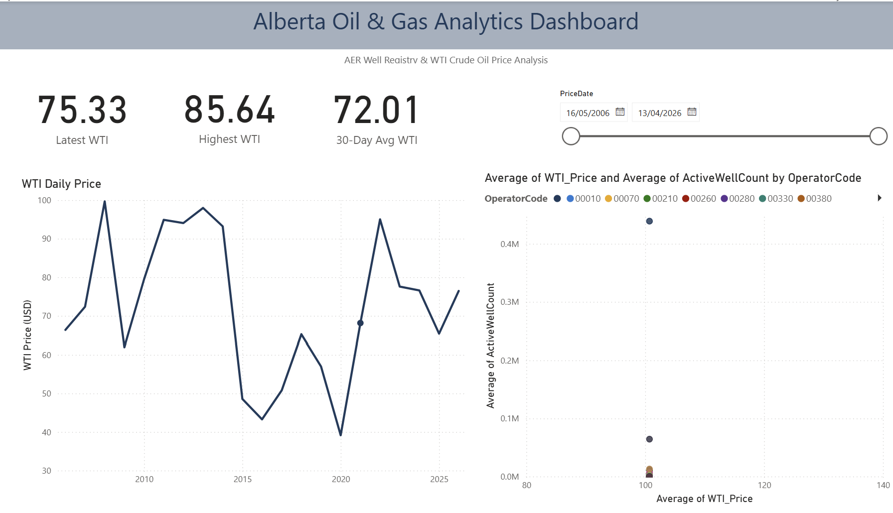
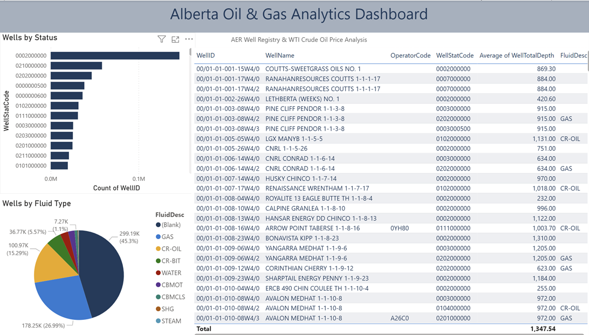
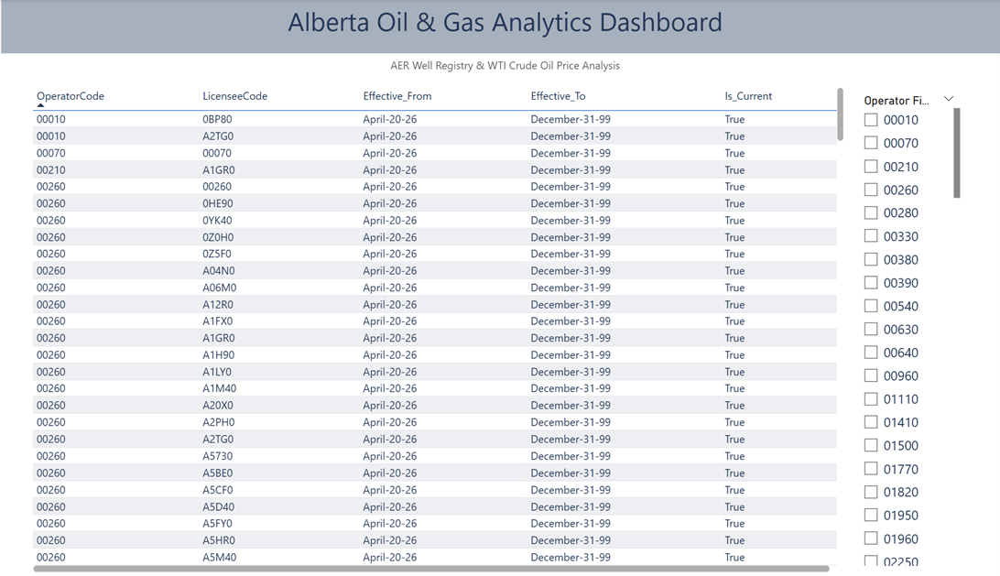
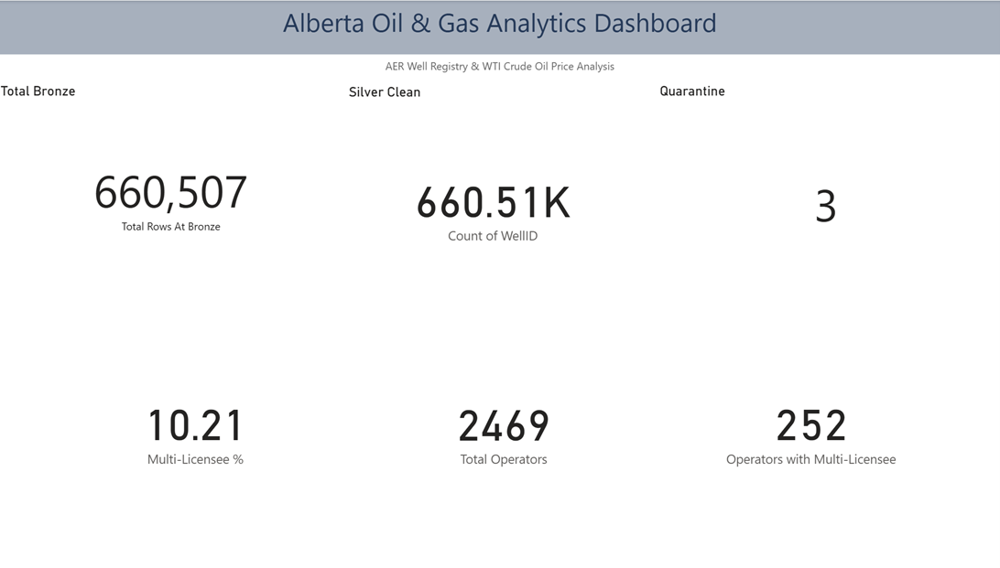

# Alberta Oil & Gas Analytics Pipeline

End-to-end Azure data engineering solution processing **660K+ Alberta Energy Regulator (AER) well records** and **WTI crude oil price data** through an incremental **Bronze → Silver → Gold** architecture.

The solution implements Azure data engineering patterns including **timestamp-based incremental ingestion, SCD Type 2 history, replay/backfill recovery, deterministic processing windows, data quality and quarantine, end-to-end lineage, configuration-driven operational control, auditing, idempotency, controlled failure propagation, security, CI/CD, and Power BI analytics**.

---

## Architecture


### High-Level Architecture

```text
AER ST37 / On-Prem SQL Server              EIA REST API
        |                                      |
        | Self-Hosted Integration Runtime      | HTTPS / REST
        +------------------+-------------------+
                           |
                           v
                  Azure Data Factory
        |
        v
ADLS Gen2 Bronze
        |
        | Incremental Window
        v
Synapse Serverless SQL / CETAS
        |
        +-------------------------+
        |                         |
        v                         v
ADLS Silver Clean          ADLS Quarantine
        |
        v
Azure SQL Staging
        |
        v
Azure SQL Gold
  - SCD Type 2 Dimensions
  - SCD Type 1 Dimensions
  - Facts
  - Analytical View
        |
        +--> Gold Data Quality
        +--> ADLS Gold Archive
        +--> Reconciliation
        |
        v
Power BI
```

**Pattern:** Batch Medallion Architecture with incremental ST37 processing, dimensional modeling, operational controls, and analytical delivery.

---

## Key Engineering Features

- Timestamp-based incremental ingestion using persistent watermarks
- REST API ingestion for EIA WTI crude oil prices
- Deterministic processing windows using `WindowKey`
- End-to-end execution lineage using `BatchId`
- `NORMAL`, `REPLAY`, and `BACKFILL` processing modes
- Safe watermark handling during replay and historical backfill
- Bronze → Silver validation with rejected-row quarantine
- SCD Type 2 history for wells and operator/licensee relationships
- SCD Type 1 / UPSERT handling for reference dimensions
- Gold-level SCD2 integrity checks
- Bronze/Silver/Quarantine reconciliation
- Configuration-driven control and audit framework
- Source freshness monitoring for operational SLA visibility
- Pipeline-level row counts, timings, status, and failure logging
- ADF concurrency plus SQL idempotency protection
- Reusable error handling with child-to-master failure propagation
- Explicit `NO_DATA` handling as a successful business outcome
- Azure Key Vault and Managed Identity security
- GitHub Actions CI/CD for ADF deployment
- Five-page Power BI analytical dashboard

---

## Source Systems

### 1. Alberta Energy Regulator ST37

AER ST37 well registry data is ingested from an on-premises SQL Server source.

- **Source:** On-premises SQL Server
- **Source table:** `dbo.WellList`
- **Source volume:** 660K+ records
- **Source columns:** 24
- **Connectivity:** ADF Self-Hosted Integration Runtime
- **Incremental column:** `LastModifiedDateTime`
- **Landing format:** Parquet
- **Landing layer:** ADLS Gen2 Bronze

ST37 follows the complete medallion processing path:

```text
On-Prem SQL
    → Bronze
    → Silver / Quarantine
    → Azure SQL Staging
    → SCD2 Gold
    → Gold DQ
    → Gold Archive
    → Reconciliation
```

### 2. EIA WTI Crude Oil Prices

WTI crude oil price data is sourced from the U.S. Energy Information Administration (EIA) REST API and integrated into the same analytical platform as the AER well data.

- **Source:** EIA REST API
- **Endpoint:** `https://api.eia.gov/v2/petroleum/pri/spt/data/`
- **Authentication:** API key stored in Azure Key Vault
- **Orchestration:** Azure Data Factory
- **Landing:** ADLS Gen2 Bronze
- **SQL staging:** `staging.OilPrice`
- **Gold target:** `gold.Fact_OilPrice`
- **Reliability pattern:** Pagination, retry handling, and controlled API ingestion
- **Analytics use:** WTI price trends and well/market analysis

Planned EIA processing path:

```text
EIA REST API
    → ADF API Ingestion
    → ADLS Bronze
    → Azure SQL Staging
    → Gold Fact_OilPrice
    → Power BI / Well Market Analysis
```

The EIA branch is included in the target solution architecture and is being completed alongside the ST37 operational framework.

---

## Incremental ST37 Processing

The ST37 pipeline uses timestamp-based incremental extraction rather than repeatedly loading the entire source table.

The extraction predicate is:

```sql
WHERE LastModifiedDateTime > @WindowStart
  AND LastModifiedDateTime <= @WindowEnd
```

This establishes a deterministic processing interval and prevents overlap between consecutive successful windows.

### Watermark

The operational watermark stores the last successfully processed timestamp.

For a normal run:

```text
WindowStart = LastSuccessfulLoadTimestamp
WindowEnd   = Current processing cutoff
```

Only a successful `NORMAL` run advances the operational watermark.

Historical `REPLAY` and `BACKFILL` runs do **not** advance it.

---

## Deterministic WindowKey

Every ST37 processing interval receives a deterministic `WindowKey` derived from its start and end timestamps.

Example:

```text
WindowStart = 2026-09-05T23:43:19
WindowEnd   = 2026-09-05T23:49:21

WindowKey = 20260905234319_20260905234921
```

The same key is propagated through downstream stages and storage paths.

```text
/bronze/well/window=<WindowKey>/
/silver/clean/window=<WindowKey>/
/quarantine/well_rejects/window=<WindowKey>/
```

This makes historical windows reproducible and traceable.

---

## Run Modes

### NORMAL

Used for regular incremental production processing.

- Reads from the last successful watermark
- Calculates the current processing cutoff
- Automatically derives the `WindowKey`
- Advances the watermark after successful processing

### REPLAY

Used to rerun an exact historical window for recovery, investigation, or deterministic reprocessing.

- Requires explicit `WindowStart`
- Requires explicit `WindowEnd`
- Reuses the same incremental predicate
- Does **not** advance the operational watermark

### BACKFILL

Used to process a historical range containing missing, late-arriving, or corrected data.

- Requires explicit historical boundaries
- Can be divided into smaller windows for large historical ranges
- Does **not** advance the operational watermark

This separation allows historical recovery without corrupting normal incremental state.

---

## Medallion Architecture

### Bronze Layer

Bronze stores source data before cleansing.

```text
/bronze/well/window=<WindowKey>/
/bronze/oilprice/<partition>/
```

ST37 data is stored as Parquet.

### Silver Layer

Silver contains validated and standardized well records.

```text
/silver/clean/window=<WindowKey>/
```

Processing includes:

- Type standardization
- Removal of unnecessary columns
- Standardization of `N/A` values to `NULL`
- Validation of required business fields
- Separation of invalid records

### Quarantine Layer

Invalid records are preserved instead of being silently discarded.

```text
/quarantine/well_rejects/window=<WindowKey>/
```

Validation scenarios include:

- `NULL_UWI`
- `INVALID_DATE`
- `NEGATIVE_DEPTH`

Rejected rows retain a reason that can be investigated independently.

### Gold Layer

The final relational dimensional model is stored in Azure SQL Database.

Gold datasets are also archived to ADLS in Parquet format for recovery and analytical use.

---

## Data Transformation

### Azure Data Factory

ADF is used for:

- Pipeline orchestration
- On-premises SQL extraction
- REST API ingestion
- Incremental window management
- Copy Activities
- Parameter propagation
- Run-mode handling
- Dependency management
- Retry behavior
- Failure propagation
- Operational control

### Azure Synapse Serverless SQL

Synapse Serverless SQL with CETAS is used for file-oriented transformations between Bronze and Silver.

Typical responsibilities include:

- Reading Bronze Parquet
- Data validation
- Type conversion
- Standardization
- Writing clean Silver Parquet
- Writing rejected rows to Quarantine

### Azure SQL Database

Azure SQL provides the mutable relational processing layer for:

- Staging
- SCD Type 1
- SCD Type 2
- Fact processing
- Dimensional modeling
- Pipeline control
- Watermarks
- Auditing
- Data-quality results
- Failure logging

Because Parquet files are immutable for row-level update operations, SCD Type 2 expiration and insertion are implemented in Azure SQL.

---

## Target Data Model

### Staging Schema

- `staging.Silver_Wells`
- `staging.OilPrice`

### Gold Schema

| Object | Pattern | Purpose |
|---|---|---|
| `gold.Dim_Operator` | SCD Type 2 | Historical operator/licensee relationships |
| `gold.Dim_Well` | SCD Type 2 | Historical well attributes |
| `gold.Dim_LicenceStatus` | SCD Type 1 / UPSERT | Current licence-status reference |
| `gold.Dim_WellType` | SCD Type 1 / UPSERT | Current well-type reference |
| `gold.Fact_OilPrice` | UPSERT | WTI crude oil price facts |
| `gold.Fact_WellSnapshot` | Daily snapshot | Current well-state snapshot |
| `gold.vw_WellMarketTrend` | Analytical view | Combined well/market analysis |

---

## SCD Type 2 Historical Tracking

SCD Type 2 is implemented for:

- `gold.Dim_Operator`
- `gold.Dim_Well`

When a tracked value changes:

```text
Current historical row
    ↓
Expire existing version
    ↓
Is_Current = 0
Effective_To = change date
    ↓
Insert new version
    ↓
Is_Current = 1
Effective_To = 9999-12-31
```

This preserves point-in-time history instead of overwriting previous values.

### SCD2 Validation

The implementation was validated by modifying a tracked operator/licensee value and rerunning the Gold processing.

Validation confirmed that:

- The old version remained available
- The old current record was expired
- A new current version was inserted
- `Effective_From`, `Effective_To`, and `Is_Current` correctly represented the history

---

## Configuration-Driven Control & Audit Framework

Azure SQL contains a dedicated operational framework for controlling and observing pipeline execution.

| Control Object | Responsibility |
|---|---|
| `control.PipelineConfig` | Runtime configuration, lookback, retry, and operational thresholds |
| `control.PipelineWatermark` | Incremental watermark and last successful processing state |
| `control.PipelineControl` | Master batch lifecycle, status, row counts, and run-mode flags |
| `control.PipelineRunDetail` | Pipeline execution metrics, row counts, timings, and errors |
| `control.DataQualityResult` | Data-quality and reconciliation results |
| `dbo.ADF_Pipeline_Log` | Operational failure and skip logging |
| `control.SourceFreshness` | Source-freshness/SLA monitoring framework |

Configuration tables define runtime behavior, while control and audit tables persist execution state, lineage, metrics, and operational events.

---

## BatchId & WindowKey Lineage

Two identifiers are used for traceability.

### BatchId

`BatchId` identifies an end-to-end execution.

Example:

```text
BATCH_20260906_045206_ac047097
```

### WindowKey

`WindowKey` identifies the exact source data interval being processed.

```text
BatchId   → execution lineage
WindowKey → data-window lineage
```

Together they allow a processing window to be traced across:

```text
Bronze
  → Silver
  → Quarantine
  → Staging
  → Gold
  → Data Quality
  → Archive
  → Reconciliation
```

---

## Pipeline Status Model

The framework separates technical execution state from business data outcome.

### Technical Status

```text
RUNNING
SUCCESS
FAILED
```

### Data Load Status

```text
WITH_DATA
NO_DATA
FAILED
```

For example, a successful incremental window with no new records is represented as:

```text
Status         = SUCCESS
DataLoadStatus = NO_DATA
```

This prevents valid zero-row runs from being treated as technical failures.

---

## NO_DATA Handling

An incremental source may legitimately contain no new records.

The master orchestrator therefore routes the result explicitly:

```text
WITH_DATA
    → continue downstream

NO_DATA
    → close master successfully
    → skip unnecessary downstream processing

FAILED
    → controlled failure path
```

`NO_DATA` is not treated as an alert-worthy failure by itself.

---

## Idempotency & Concurrency

Duplicate and overlapping execution is protected at multiple levels.

### ADF Concurrency

The controlled ST37 master pipeline uses:

```text
concurrency = 1
```

When another master execution is already active, a second invocation is queued rather than processing concurrently.

### SQL Active-Run Guard

A SQL idempotency check provides secondary protection by checking for a recent active master run before processing begins.

Together, these controls reduce the risk of overlapping or duplicate processing:

```text
ADF concurrency
      +
SQL active-run guard
      ↓
Reduced risk of duplicate/overlapping processing
```

---

## Error Handling & Failure Propagation

The pipeline uses a reusable common error-handling pattern.

Typical child failure flow:

```text
Processing activity fails
        ↓
Write detailed execution/failure information
        ↓
Invoke reusable error handler
        ↓
Explicitly fail child pipeline
        ↓
Master Execute Pipeline activity fails
        ↓
Close master control record as FAILED
        ↓
Explicitly fail master pipeline
```

This ensures a failed child cannot accidentally result in a successful master status.

### Audit vs Failure Logging

The framework deliberately separates two concerns:

**`control.PipelineRunDetail`**

Used for execution auditing:

- Successful stages
- Failed stages
- Row counts
- Start/end timestamps
- Duration
- Error information where applicable

**`dbo.ADF_Pipeline_Log`**

Used for operational exceptions:

- Failures
- Idempotency skips
- Operational error details

Successful activity logging is not duplicated into the failure log.

---

## Data Quality

### Bronze / Silver / Quarantine Reconciliation

The main validation relationship is:

```text
BronzeCount = SilverCount + QuarantineCount
```

Initial full-load validation:

```text
Bronze      = 660,507
Silver      = 660,504
Quarantine  = 3
```

Therefore:

```text
660,507 = 660,504 + 3
```

### Gold SCD2 Integrity

Gold-level DQ verifies SCD Type 2 integrity, including the rule that a business entity must not have multiple current records.

DQ outcomes are written to:

```text
control.DataQualityResult
```

and correlated with pipeline lineage.

---

## Reconciliation

The final reconciliation stage consumes upstream row counts rather than unnecessarily rescanning ADLS folders.

For ST37:

```text
BronzeCount
      =
SilverCount + QuarantineCount
```

This design also handles zero-row processing windows without requiring nonexistent Silver/Quarantine files to be read.

---

## Source Freshness Monitoring

Source freshness is tracked independently from whether an incremental run contains new rows. This distinction prevents a valid `NO_DATA` window from being incorrectly interpreted as a stale or failed source.

### ST37 Freshness

For ST37, ADF retrieves the latest available source `LastModifiedDateTime` from the on-premises SQL Server. The observation is evaluated against the configured freshness threshold in `control.PipelineConfig` and recorded in `control.SourceFreshness`.

```text
On-Prem SQL Server
      ↓
MAX(LastModifiedDateTime)
      ↓
ADF Freshness Check
      ↓
Configured Freshness Threshold
      ↓
control.SourceFreshness
```

Freshness states:

| Status | Meaning |
|---|---|
| `FRESH` | Latest source update is within the configured threshold |
| `STALE` | Latest source update exceeds the configured threshold |
| `UNKNOWN` | A latest source timestamp is unavailable |

The ST37 configuration currently uses a **24-hour freshness threshold**.

### EIA Freshness

The same monitoring pattern is designed to extend to the EIA WTI source. For the API branch, freshness will be evaluated using the latest available oil-price observation/date returned by the source and recorded through the common freshness framework.

This provides a consistent operational distinction between:

```text
Pipeline execution status
Data availability
Source freshness
```

across both ST37 and EIA ingestion.

---

## ST37 Pipeline Orchestration

The current controlled ST37 orchestration is:

```text
Master Orchestrator
        |
        v
ST37 → Bronze Incremental
        |
        v
Bronze → Silver / Quarantine
        |
        v
Silver → Azure SQL Staging
        |
        v
SCD2 Gold Processing
        |
        v
Gold Data Quality
        |
        v
Gold → ADLS Archive
        |
        v
Reconciliation
```

The master owns the overall batch lifecycle while child pipelines own their execution-specific processing and error details.

---

## Gold Archival

Gold datasets are exported from Azure SQL to ADLS in Parquet format.

Examples include:

```text
/gold/dim_operator/
/gold/dim_well/
/gold/fact_wellsnapshot/
```

The current implementation is snapshot-oriented for several Gold objects.

This provides a recoverable analytical copy of Gold data in the lake, while more granular current-batch/delta archival remains a future optimization.

---

## Power BI Analytics

A five-page Power BI report analyzes Alberta well activity, historical dimensional changes, data quality, and WTI crude oil pricing.

Power BI consumes the Azure SQL Gold model using Import mode.

### Page 1 — Executive Summary



Provides high-level well, operator, and portfolio metrics.

### Page 2 — Oil Price Trends



Analyzes historical WTI crude oil prices and market trends.

### Page 3 — Well Activity



Explores well status, type, depth, field, and operator distributions.

### Page 4 — Operator Analysis / SCD2



Demonstrates historical operator/licensee relationships preserved through SCD Type 2 processing.

### Page 5 — Data Quality



Summarizes validation, quarantine, reconciliation, and historical-data quality observations.

---

## Business Questions

| # | Question | Gold Source |
|---|---|---|
| Q1 | How are wells distributed by field and operator? | `gold.Fact_WellSnapshot` |
| Q2 | Which operators manage the largest well portfolios? | `gold.Dim_Operator` + `gold.Fact_WellSnapshot` |
| Q3 | How has WTI crude oil pricing changed over time? | `gold.Fact_OilPrice` |
| Q4 | How can well activity be analyzed alongside market pricing? | `gold.vw_WellMarketTrend` |
| Q5 | How have operator/licensee relationships changed historically? | `gold.Dim_Operator` |
| Q6 | How are wells distributed by well type and licence status? | `gold.Dim_WellType` + `gold.Dim_LicenceStatus` |

---

## Security

Azure Key Vault is used for secret management.

Examples include:

- EIA API key
- On-premises SQL Server credentials

Authentication and secret retrieval use:

- Azure Managed Identity
- Microsoft Entra ID
- Key Vault-linked service references
- Runtime secret retrieval where required

No credentials are intentionally hardcoded into pipeline source definitions.

---

## CI/CD

ADF artifacts are source-controlled and deployed using GitHub Actions.

The project uses version-controlled pipeline JSON and deployment automation so changes can be reviewed and promoted through source control rather than relying solely on manual ADF Studio changes.

---

## Technology Stack

| Area | Technology |
|---|---|
| Cloud | Microsoft Azure |
| Orchestration | Azure Data Factory |
| On-premises connectivity | Self-Hosted Integration Runtime |
| Data lake | Azure Data Lake Storage Gen2 |
| File format | Parquet |
| File transformation | Azure Synapse Serverless SQL / CETAS |
| Relational processing | Azure SQL Database |
| Incremental processing | Timestamp watermark + deterministic windows |
| Historical modeling | SCD Type 2 |
| API ingestion | EIA REST API |
| Security | Azure Key Vault, Managed Identity, Microsoft Entra ID |
| Analytics | Power BI |
| CI/CD | GitHub Actions |
| Development | SQL, ADF expressions, JSON |

---

## Cost-Conscious Architecture

The architecture uses serverless and consumption-oriented services where practical.

Key decisions include:

- Synapse Serverless SQL for lake transformations instead of an always-on analytical cluster
- Azure SQL Database for mutable SCD operations
- Parquet for efficient lake storage
- Incremental ST37 extraction rather than repeated full-source ingestion
- ADF orchestration for managed workflow execution

Cost varies by region, service tier, execution frequency, data volume, and retention requirements.

---

## Key Design Decisions

- **Incremental ingestion:** Persistent timestamp watermarks and deterministic windows avoid repeated full-source extraction.
- **Historical recovery:** `REPLAY` and `BACKFILL` are isolated from the operational watermark.
- **Mutable SCD processing:** Azure SQL is used for SCD Type 2 expiration/insertion while Parquet remains the lake storage format.
- **Data accountability:** Invalid records are quarantined and cross-layer reconciliation verifies `Bronze = Silver + Quarantine`.
- **Lineage:** `BatchId` identifies an execution and `WindowKey` identifies its data interval.
- **Execution safety:** ADF concurrency and a SQL active-run guard provide complementary protection against overlapping processing.
- **Operational observability:** Run metrics, DQ results, and failure events are stored separately according to purpose.
- **Cost-conscious compute:** Serverless lake transformation is combined with Azure SQL for mutable relational workloads.

---

## Project Deliverables

- Azure Data Factory pipeline JSON
- Azure SQL DDL scripts
- Azure SQL control/audit stored procedures
- Synapse Serverless CETAS transformations
- SCD Type 1 and SCD Type 2 SQL logic
- Architecture diagram
- Power BI report
- Dashboard screenshots
- GitHub Actions deployment workflow

---

## Repository Structure

```text
.
├── architecture/
│   └── aer_architecture.png
├── pipelines/
│   └── ADF pipeline JSON
├── sql/
│   ├── ddl/
│   ├── transformations/
│   ├── scd2/
│   └── control/
├── powerbi/
│   ├── AER_OilGas_Dashboard.pbix
│   └── screenshots/
└── README.md
```


---

## Solution Summary

This solution demonstrates an Azure-based batch data platform for ingesting, validating, transforming, historizing, and serving AER well-registry and EIA WTI crude-oil-price data for analytics. The design emphasizes incremental processing, recoverability, data quality, lineage, operational observability, security, and cost-conscious service selection.

---

**Author:** Kowsalya Gopinathan  
**Location:** Calgary, Alberta
